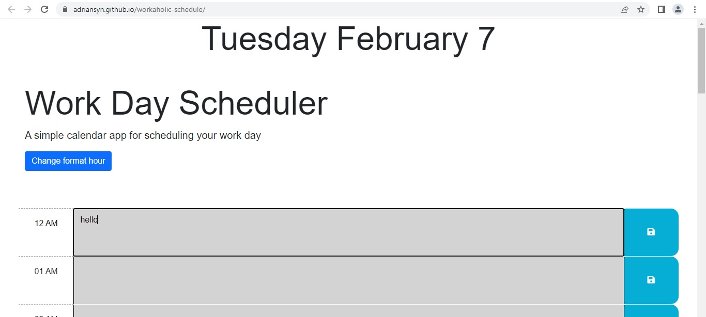

# 05 Third-Party APIs: Work Day Scheduler
 Workaholic Schedule Planner

 The functionality of this schedule planner is that it will display the Past tense state of your planner, Present and Future of your programmed tasks.
 
 It contains one section per one hour of the day, therefore; you will be able to add comments or task to the planner according to the hour you set you task to. 
 
 Grey= Past,
 Red= Present,
 Green= Future,
 The program will automaticaly update the current state of the planner based on the time of your local machine.
 
 The user information will be saved to local storage. 

 EXTRA; A button was added to changed the standard AM/PM time to Military time format to accomodate the experience to the user's desire.

 Please see screen shot for visual reference.
 
 Screen shot for Past tense task of the program
  
  Screen shot for Present and Future task.
  
  Screen shot for local storage.
  
